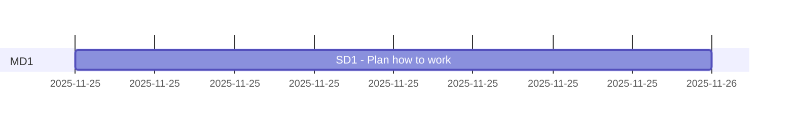

# CalApp workshop

Abbreviations
> * PM Product Milestone
> * MD Milestone division
> * SD Subdivision

## Analyzing all parts

|#|Part|Details|Total Duration|Status|
|:-|:-|:-|:-|:-|
|1|[Develop](%base_url%/pm#Develop_timeplan)|2025-11-25 - |- hours|ONGOING|
|2|[Maintenance](%base_url%/pm#Maintenance_timeplan)|-|- hours|-|
|:-|:-|:-|::||


## Develop timeplan



## Maintenance timeplan

```mermaid
gantt
    section MD1
```

# Stories/cards MD1 - Develop

>## 48-001
>
>### Goal : Add README and DECK
>The goal of this card is to structure this repo.
>It also aims to add a deck file to the repo.
>
>### DOD  (definition of done):
>Hooks files are added to the local repo.
>A Deck file is created for the progect
>
>### TODO :
>- [x] 1. Add git hooks' scripts
>- [x] 2. Updated Deck path
>- [x] 3. Add a deck file to the repo
>- [x] 4. Add a time plan and pre-stories to plan how to work on the project
>
>### Reports :
>* 
>
>### Steps to test and debugging:
>- [] 1.
>
>### References :
>* []()
---

# Stories/cards MD1 - Maintenance