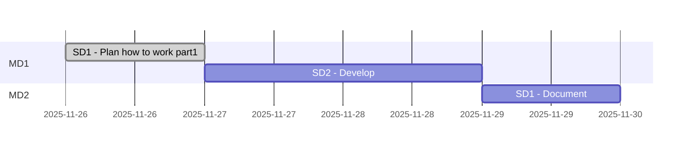

# CalApp workshop

Abbreviations
> * PM Product Milestone
> * MD Milestone division
> * SD Subdivision

## Analyzing all parts

|#|Part|Details|Total Duration|Status|
|:-|:-|:-|:-|:-|
|1|[Develop](%base_url%/pm#Develop_timeplan)|2025-11-25 - |- hours|ONGOING|
|2|[Maintenance](%base_url%/pm#Maintenance_timeplan)|-|- hours|-|
|:-|:-|:-|::||


## Develop timeplan



## Maintenance timeplan

```mermaid
gantt
    section MD1
```

# Stories/cards MD1 - Develop

## 48-001
### Add README and DECK 
<details>
    <summary>Details</summary>

>The goal of this card is to structure this repo.
>It also aims to add a deck file to the repo.
>
>### DOD  (definition of done):
>Hooks files are added to the local repo.
>A Deck file is created for the progect
>
>### TODO :
>- [x] 1. Add git hooks' scripts
>- [x] 2. Updated Deck path
>- [x] 3. Add a deck file to the repo
>- [x] 4. Add a time plan and pre-stories to plan how to work on the project
>
>### Reports :
>* 
>
>### Steps to test and debugging:
>- [] 1.
>
>### References :
>* []()

</details>


## 48-002
### CalAppV1 
<details>
    <summary>Details</summary>

>The goal of this card is to develop CalAppV1 (a singel java file) - Coding a simple java code to get numbers and oprtors as input (all sepertly) and then print results.
>
>### DOD  (definition of done):
>CalAppV1 is coded and pushed.
>
>### TODO :
>- [x] 1. Start with a class that recognizes operators
>- [x] 2. Add operators methods
>- [x] 3. Update documents
>- [x] 4. Improve
>- [x] 5. Add doxygen
>
>### Reports :
>* 
>
>### Steps to test and debugging:
>- [] 1.
>
>### References :
>* []()

</details>


## 48-003
### CalAppV2 
<details>
    <summary>Details</summary>

>The goal of this card is to code a parser base.
>
>### DOD  (definition of done):
>CalAppV2 is coded and pushed.
>
>### TODO :
>- [x] 1. Start with a class that inputs an expression
>- [x] 2. Add an expression parser
>- [x] 3. Add doxygen
>- [x] 4. Update documents
>- [x] 5. Improve
>- [x] 6. Update DECK
>
>### Reports :
>* 
>
>### Steps to test and debugging:
>- [] 1.
>
>### References :
>* []()
</details>


## 48-004
### Recode CalAppV2 in a Maven project. 
<details>
    <summary>Details</summary>

>The goal of this card is to Recode CalAppV2 in a Maven project.
>
>### DOD  (definition of done):
>CalApp is coded and pushed.
>Finings are documented.
>
>### TODO :
>- [x] 1. Recap findings about Maven
>- [x] 2. Create a simple template for CalApp
>- [x] 3. Update CalApp template with a real code
>- [x] 4. Pulling out CalApp class from the main App class
>- [x] 5. Update documents
>- [x] 6. Update DECK
>
>### Reports :
>* see https://github.com/hoss-java/calapp-workshop/blob/main/DECK.md#add-some-tests-to-the-maven-version-of-calappv2-
>
>### Steps to test and debugging:
>- [] 1.
>
>### References :
>* []()
</details>


## 48-005
### Add some tests to the maven version of CalApp. 
<details>
    <summary>Details</summary>

>The goal of this card is to add some tests to the maven version of CalApp.
>
>### DOD  (definition of done):
>CalApp is coded and pushed.
>Finings are documented.
>
>### TODO :
>- [x] 1. Recap how to run a test
>- [x] 2. Code an empty test
>- [x] 3. Update the empty test to test a method
>- [x] 4. Try to use stub and mock
>- [x] 5. Create and code test file for each file (unit test)
>- [x] 6. Update unit tests to JUnit 5
>- [ ] 7. Create a block test
>- [ ] 8. Update documents
>- [ ] 9. Update DECK
>
>### Reports :
>* 
>
>### Steps to test and debugging:
>- [] 1.
>
>### References :
>* []()
</details>


## 48-006
### Recode CalApp as a spring project 
<details>
    <summary>Details</summary>

>The goal of this card is to recode CalAppV2 as a spring project.
>
>### DOD  (definition of done):
>CalAppV2 is coded and pushed.
>Finings are documented.
>
>### TODO :
>- [ ] 1. 
>
>### Reports :
>* 
>
>### Steps to test and debugging:
>- [] 1.
>
>### References :
>* []()
</details>


## 48-007
### Impliment CalApp to Tomcat as a service 
<details>
    <summary>Details</summary>

>The goal of this card is to develop a version of CalAppV2 to impliment to Tomcat as a service.
>
>### DOD  (definition of done):
>All finings are documented.
>CalAppV2 is coded and pushed.
>
>### TODO :
>- [ ] 1. Document all findings
>
>### Reports :
>* 
>
>### Steps to test and debugging:
>- [] 1.
>
>### References :
>* []()
</details>


## 48-008
### Investigate about useful tools. 
<details>
    <summary>Details</summary>

>The goal of this card is to investigate about useful tools and methods (WOW) that can make it easre/faster to code.
>
>### DOD  (definition of done):
>All finings are documented.
>
>### TODO :
>- [ ] 1. Document all findings
>
>### Reports :
>* 
>
>### Steps to test and debugging:
>- [] 1.
>
>### References :
>* []()
</details>


## 48-009
### Spike how to automate tests 
<details>
    <summary>Details</summary>

>The goal of this card is to spike how to automate tests.
>
>### DOD  (definition of done):
>All finings are documented.
>
>### TODO :
>- [ ] 1. Document all findings
>
>### Reports :
>* 
>
>### Steps to test and debugging:
>- [] 1.
>
>### References :
>* []()
</details>


# Stories/cards MD2 - Develop


# Stories/cards MD1 - Maintenance